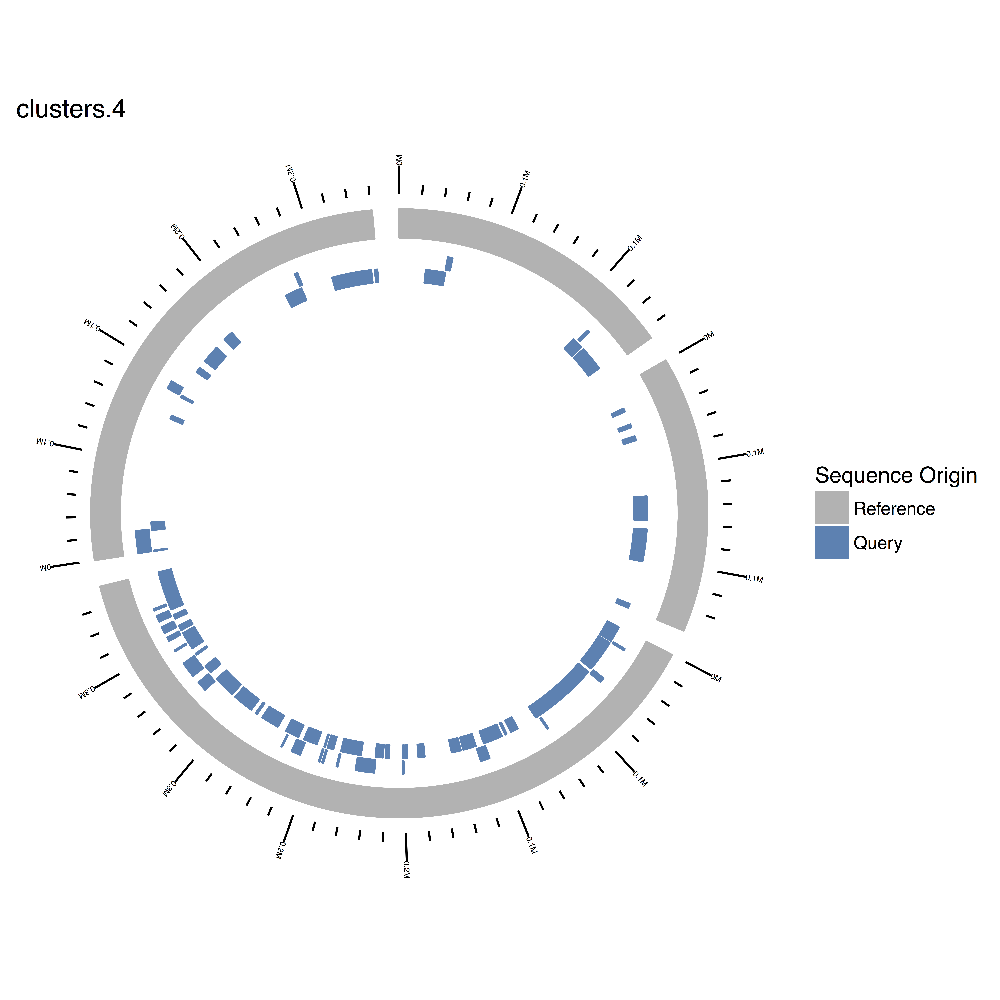

I use the NUCmer script from the [MUMmer package](https://github.com/mummer4/mummer) frequently to align multifastas. Typically, I want to know where large sequences align from two fragmented assemblies. Although the MUMmer `show-coords` script formats the NUCmer output in a nice table, I have been seeking a better way to visualize the results. My solution is below! It primarily uses the GenomicRanges and ggbio R packages to make the plot. 

```{r setup, include=FALSE}
knitr::opts_chunk$set(echo = TRUE, eval = FALSE, include = FALSE, tidy = TRUE, message = FALSE)
```

## Comparing two multifastas with NUCmer

I generally compare one multifasta that I have created (i.e., assembling and binning metagenome data from the SRA, assembling RNA-seq data from the SRA, etc.) to a reference genome or metagenome multifasta. For this analysis, each multifasta was created by concatenating the bins of metagenomes -- so each file ended up being multi-multifastas. This essentially meant that I had a few more bookkeeping steps during data processing to keep track of each sequence. However, once I have two multifastas, my MUMmer analysis looks something like the following:

```{r NUCmer script, engine='bash', eval = FALSE}
# Ran with mummer-4.0.0beta1
nucmer --mum reference.fasta query.fasta -p query_ref_nucmer
```

This produces a file named `query_ref_nucmer.delta` that can then be filtered using `delta-filter` and formatted using `show-coords` to produce a human-readable table of overlapping alignments between the two multifastas. I've included the loop I use to do this below, because inevitably I always have more than one `.delta` file to process. 

The `-l` in `delta-filter` sets the minimum alignment length to 1000. The `-q` "Maps each position of each query to its best hit in the reference, allowing for reference overlaps".

The `-c` and `-l` in `show-coords` indicate that percent identity and sequence length information, respectively, should be included in the output. `-L` sets the minimum alignment length to display, `-r` sorts the output lines by reference IDs and coordinates, and `-T` switches the output to tab-delimited format.

```{r filter NUCmer, engine='bash', eval = FALSE }
for infile in *delta
do
  j=$(basename $infile .delta)
  delta-filter -l 1000 -q ${infile} > ${j}_filter.delta
  show-coords -c -l -L 1000 -r -T ${j}_filter.delta | gzip > ${j}_filter_coords.txt.gz
done
```

## Other multifasta information needed for plotting

Other than the output produced by NUCmer, a bit more information is needed about the multifastas that will be plotted. The names of the contigs that belong to each cluster (or chromosome) and the length of each contig within each cluster are needed to make a meaningful GRanges object in R. These files can be produced with the following code:

```{r supporting files, eval = FALSE}
# create file of contig names inside of multifasta file

grep ">" clusters.1.fasta > clusteres.1.headers.txt
```
```{r supporting files2, eval = FALSE, echo = TRUE}
# create file with contig names and lengths
# source: http://www.danielecook.com/generate-fasta-sequence-lengths/

cat clusters.1.fasta | awk '$0 ~ ">" {print c; c=0;printf substr($0,2,100) "\t"; } $0 !~ ">" {c+=length($0);} END { print c; }' > clusters.1.lengths.txt 
```

Note that the table produced by `show-coords` (that will be imported into R) will have the length of the reference contig as a metadata column. However, because not all reference contigs may have queries that align, a reference contig may be missing from the `show-coords` output. By generating fasta headers and lengths independently, we can be sure that all of the reference contigs are plotted.

## Plotting in R

With a little bit of wrangling, a circle plot that shows where the query multifasta overlaps with the reference multifasta can be created in R.

Some pre-formatting is necessary to read all the data in and get it into the right format (GRanges objects). I've made a few functions that will be grouped together into a larger function to accomplish these tasks.

`load-coords` loads the filtered NUCmer output into R as a GRanges object, and only includes the alignments where percent identity was 100%. It takes advantage of a function written by [Timothee Flutre](https://github.com/timflutre) to load the NUCmer object in as a GRanges object. 
```{r load-NUCmer-as-GRange}
load_coords <- function(coords_file){ 
  library(rutilstimflutre)
  # Read in nucmer results as a GRanges object
  coords <- loadMummer(coords_file, algo = "nucmer")
  # filter out entries with perc.id != 100
  coords <- coords[(elementMetadata(coords)[, "perc.id"] == 100.00)]
  
  # drop sequence levels that are no longer used 
  seqlevels(coords) <- seqlevelsInUse(coords)
  
  # set seqlengths in GRange object
      # initiate an empty vector
      seqlengths_vector <- vector()
      # make a vector of the sequence names in te GRange object
      sequence_names <- unique(as.vector(seqnames(coords)))
      # subset by each unique seqname
      # get length of sequence from metadata column ref.len
      for(i in seq(length(sequence_names))){
        subset_coords <- coords[seqnames(coords) == sequence_names[i]]
        seqlengths_vector[i] <- subset_coords[1]$ref.len
      }
     # set sequence lengths 
     seqlengths(coords) <- seqlengths_vector
  
  return(coords)
}
```

`get_contig_cluster` reads in the names of the fastas contained in a multifasta and creates a dataframe where the cluster of origin is also indicated.

```{r get_contig_cluster}
# create dataframe of contig names with cluster origin of the contig indicated in a separate column
get_contig_cluster <- function(fasta_header_file){
  # read in cluster names, and make a dataframe with cluster as a factor
  fasta_headers <- read.table(fasta_header_file, stringsAsFactors = FALSE)
  # remove >
  fasta_headers[] <- lapply(fasta_headers, gsub, pattern='>', replacement='')
  # get character string from cluster origin
  cluster <- basename(fasta_header_file)
  cluster <- gsub(".fasta.headers.txt", "", cluster)
  # create a vector of cluster names
  cluster_vector <- rep(cluster, length(fasta_headers))
  # bind together fasta header names and cluster identifier
  labeled_headers <- cbind(fasta_headers, cluster_vector)
  
  return(labeled_headers)
}
```

The `circular_plot_w_ref` function takes two GRanges objects, one for a reference and one for the NUCmer comparison, and produces a circular plot comparing the two.

```{r circular_plot_w_ref}
circular_plot_w_ref <- function(reference_GRange, cluster_of_interest, GRange_of_interest){
  # This function produces a plot showing where the reference_GRange (reference sequence) , 
  # and the GRange_of_interest (is the query)query sequence) align. 
  # reference_GRange: a GRanges object with the sequence lengths and names for a reference sequence
  # cluster_of_interest: a character string indicating which sequence is plotted; used for the title
  # GRange_of_interest: a GRanges object produced by reading in a show-coords processed NUCmer object.
  
  library(ggplot2)
  library(ggbio)

  p <- ggbio() + 
    circle(GRange_of_interest, geom = "rect", aes(color = "steelblue", fill = "steelblue")) + # NUCmer obj
    circle(reference_GRange, geom = "ideo", aes(color = "gray70", fill = "gray70")) + #Ideogram of ref genome
    circle(reference_GRange, geom = "scale", scale.type = "M", size = 1.5) + #Scale from seqlengths of ref genome
    # circle(reference_GRange, geom = "text", aes(label = seqnames), size = 2) + #Uncomment for sequence label
    scale_color_manual(name = "Sequence Origin", labels = c("Reference", "Query"), 
                       values = c("gray70", "steelblue")) +
    scale_fill_manual(name = "Sequence Origin", labels = c("Reference", "Query"), 
                      values = c("gray70", "steelblue")) +
    ggtitle(cluster_of_interest)
  return(p)
}
```

`load_and_plot_nucmer` puts these functions together, along with a few more lines of code, to produce a plot. I reads in the NUCmer object, then creates a GRanges object for the reference, then makes sure that the information between the two GRanges objects matches, and lastly plots the two GRanges objects together.

```{r load_and_plot_nucmer_w_ref}
load_and_plot_nucmer_w_ref <- function(NUCmer_coords_file, dir_of_cluster_headers, cluster_lengths_file, cluster_of_interest){
  # NUCmer_coords_file: string for file path of NUCmer output produced by show coords
  # dir_of_cluster_headers: string for directory path where files with names of cluster headers are 
  # cluster_lengths_file: string for path of file that contains lengths of contigs for cluster of interest
  # cluster_of_interest: string indicating cluster of interest (i.e. clusters.1).
  library(GenomicRanges)
  # Make GRanges object of NUCmer show coords output file
  NUCmer_coords <- load_coords(NUCmer_coords_file)
  
  # List files that contain fasta headers from cluster multifastas
  files <- list.files(dir_of_cluster_headers, pattern = "*fasta*", full.names = TRUE)
  # Read in files and concatenate into a single dataframe
  library(plyr)
  all_cluster_headers <- rbind.fill(lapply(X = files, FUN = get_contig_cluster))
  
  # add a metadata column that inidicate the cluster in which the contig is located
  # find matches between the seqnames in the NUCmer GRanges object and the names of fastas in the clusters
  matches <- as.vector(match(seqnames(NUCmer_coords), all_cluster_headers$V1))
  # Add a metadata column for cluster origin
  values(NUCmer_coords) <- cbind(values(NUCmer_coords), DataFrame(all_cluster_headers$cluster_vector[matches]))
  # rename the column 
  colnames(values(NUCmer_coords))[7] <- "cluster_origin"
  
  
  # Read in length information about the reference sequences
  cluster_fasta_lengths <- read.table(cluster_lengths_file, stringsAsFactors = FALSE)
  
  # created a GRanges object for reference sequences
  referenceGR <- GRanges(seqnames = Rle(cluster_fasta_lengths$V1),
                         ranges = IRanges(start = rep(1, length(cluster_fasta_lengths$V2)), 
                                          end = cluster_fasta_lengths$V2))
  # add seqlengths to the reference GRanges object 
  seqlengths(referenceGR) <- cluster_fasta_lengths$V2
  genome(referenceGR) <- cluster_of_interest
  referenceGR <- sortSeqlevels(referenceGR)
  referenceGR <- sort(referenceGR)
  
  # select one cluster to plot by subsetting the NUCmer GRanges object
  cluster_coords <- NUCmer_coords[NUCmer_coords$cluster_origin == cluster_of_interest]
  # sort and set seqinfo for the cluster object; must match the reference_GRange obj for proper plotting
  seqlevels(cluster_coords) <- seqlevelsInUse(cluster_coords)
  genome(cluster_coords) <- cluster_of_interest
  cluster_coords <- sortSeqlevels(cluster_coords)
  cluster_coords <- sort(cluster_coords)
  seqlevels(cluster_coords) <- seqlevels(referenceGR)
  seqlengths(cluster_coords) <- seqlengths(referenceGR)
  
  plot <- circular_plot_w_ref(referenceGR, cluster_of_interest, cluster_coords)
  
  return(plot)
}
```
```{r make plot, echo = TRUE, eval = FALSE}
load_and_plot_nucmer_w_ref("data/query_ref_nucmer_filter_coords.txt.gz", "data/headers/", "data/headers/clusters.4.lengths.txt", "clusters.4")
```


```{r make plot real, include = FALSE, echo = FALSE, eval = FALSE}
pdf("figures/nucmer_viz.pdf")
load_and_plot_nucmer_w_ref("data/m1-vs-bp6-nucmer_filter_210_coords.txt.gz", "data/bp6_headers/", "data/bp6_headers/clusters.4.lengths.txt", "clusters.4")
dev.off()
```

The plot has three tracks. The outer-most track is the scale, and it indicates the size of the contigs in the reference cluster. The gray track is an ideogram of the sequences in the reference. The blue track shows the locations of overlap between the query and the reference. When the blue track is two layers deep, there are two sequences in the query that overlap the same location on the reference.

This approach is a bit big and hairy because of the multi-multifasta format of my data. Hopefully it will give you an idea of how to visualize NUCmer output!