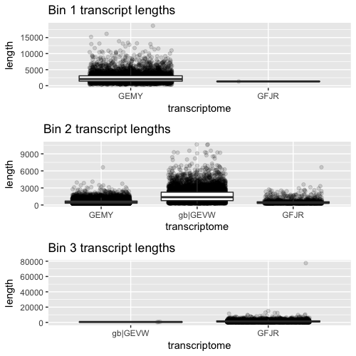

Recently, I was curious whether metagenomic binning methods would work for metatranscriptome sequences. I didn't have any well-characterized metatranscriptomes laying around, so I decided to test this by using three publicly-available fungi transcriptomes that I found in the [Transcriptome Shotgun Assembly Database](https://www.ncbi.nlm.nih.gov/Traces/wgs/?term=tsa). I queried the database for sequences that resemble those that I expect to isolate from olive oil, and found three good ones to work with:

+ *Alternaria sp. MG1*
+ *Saccharomyces cerevisiae* Y12
+ *Candida albicans*

I downloaded the transcriptomes associated with these species, as well as the RNA-seq files used to create the transcriptomes. I then used [MaxBin](https://downloads.jbei.org/data/microbial_communities/MaxBin/MaxBin.html) for binning, and R for visualization.

Transcriptomes:  
```
# Alternaria
wget ftp://ftp.ncbi.nlm.nih.gov/sra/wgs_aux/GE/MY/GEMY01/GEMY01.1.fsa_nt.gz
# Saccharomyces Y12
wget ftp://ftp.ncbi.nlm.nih.gov/sra/wgs_aux/GF/JR/GFJR01/GFJR01.1.fsa_nt.gz
# Candida albicans
wget ftp://ftp.ncbi.nlm.nih.gov/sra/wgs_aux/GE/VW/GEVW02/GEVW02.1.fsa_nt.gz
```

Read files:
```
# Alternaria
wget ftp://ftp.sra.ebi.ac.uk/vol1/fastq/SRR208/000/SRR2088030/SRR2088030_1.fastq.gz
wget ftp://ftp.sra.ebi.ac.uk/vol1/fastq/SRR208/000/SRR2088030/SRR2088030_2.fastq.gz
# Saccharomyces Y12
wget ftp://ftp.sra.ebi.ac.uk/vol1/fastq/SRR517/002/SRR5170142/SRR5170142_1.fastq.gz
wget ftp://ftp.sra.ebi.ac.uk/vol1/fastq/SRR517/002/SRR5170142/SRR5170142_2.fastq.gz
# Candida albicans
wget ftp://ftp.sra.ebi.ac.uk/vol1/fastq/SRR374/006/SRR3747616/SRR3747616.fastq.gz
```

I concatenated the transcriptome files to use as a mock assembly:
```
cat *nt_gz > cat_transcriptomes.fsa_nt.gz
```

I then installed MaxBin & supporting software (on a computer with a linux operating system):
```
# supporting software
sudo apt-get -y update && \
sudo apt-get -y install zlib1g-dev ncurses-dev unzip make \
   libc6-dev g++ zlib1g-dev bioperl libdatetime-perl libxml-simple-perl libdigest-md5-perl

sudo bash
export PERL_MM_USE_DEFAULT=1
export PERL_EXTUTILS_AUTOINSTALL="--defaultdeps"
perl -MCPAN -e 'install "XML::Simple"'
exit

# MaxBin & auxiliary software
curl  https://downloads.jbei.org/data/microbial_communities/MaxBin/getfile.php?MaxBin-2.2.2.tar.gz > MaxBin-2.2.2.tar.gz
tar xzvf MaxBin-2.2.2.tar.gz
cd MaxBin-2.2.2/src
make
./autobuild_auxiliary
```

And ran MaxBin using the RNA-seq reads I had downloaded. I used a minimum contig length of 250 to increase the number of binned contigs.
```
run_MaxBin.pl -contig ~/data_out/cat_transcriptomes.fsa_nt -reads ~/data/fastq/SRR2088030_1.fastq -reads2 ~/data/fastq/SRR2088030_2.fastq -reads3 ~/data/fastq/SRR5170142_1.fastq -reads4 ~/data/fastq/SRR5170142_2.fastq -reads5 ~/data/fastq/SRR3747616.fastq -out transcriptome_bins -min_contig_length 250
```

On an AWS instance running Ubuntu Xenial 16.04 and with 16 GB of ram, MaxBin took approximately 8 hours to complete.

I gathered some useful metrics from the `.fasta` files output by MaxBin and the original transcriptomes, like contig length and header names.

Lengths:
```
for infile in *fasta *nt
do
  cat $infile | awk '$0 ~ ">" {print c; c=0;printf substr($0,2,100) "\t"; } $0 !~ ">" {c+=length($0);} END { print c; }' > ${infile}.lengths.txt
done
```

Headers:
```
for infile in *fasta *nt
do
  grep ">" $infile > ${infile}.header.txt
done
```

I then used R to visualize how well binning performed in separating the fungal transcriptomes.

I first checked the composition of each bin. If binning performed well, each bin would primarily contain transcripts from one transcriptome.

```
# Read in fasta headers contained in bins
bin1 <- read.table("data_out/transcriptome_bins.001.headers.txt")
bin2 <- read.table("data_out/transcriptome_bins.002.headers.txt")
bin3 <- read.table("data_out/transcriptome_bins.003.headers.txt")
tooshort <- read.delim("data_out/transcriptome_bins.tooshort.headers.txt", sep = "\n")

# Function to visualize the content of each bin

plot_bin_content <- function(bin, title){
  # Use stringr to count the number of transcripts from each species in each bin
      library(stringr)
      bin_GEMY <- sapply(X = bin, function(x) sum(str_count(x, ">GEMY")))
      bin_GEVW <- sapply(X = bin, function(x) sum(str_count(x, "gb|GEVW")))
      bin_GFJR <- sapply(X = bin, function(x) sum(str_count(x, ">GFJR")))

      # make a dataframe of the counts
      bin_df <- data.frame()
      bin_df[1, 1] <- bin_GEMY
      bin_df[2, 1] <- bin_GEVW
      bin_df[3, 1] <- bin_GFJR
      bin_df <- cbind(bin_df, c("GEMY", "gb|GEVW", "GFJR"))
      colnames(bin_df) <- c("transcripts", "transcriptome")

      # plot the results
      library(ggplot2)
      ggplot(bin_df, aes(x = transcriptome, y = transcripts)) + geom_col() +
          ggtitle(title)
  }

# make a plot to visualize the content of each bin, as well as the contigs that were "tooshort"
bin1_content_plot<- plot_bin_content(bin1, "Bin 1")
bin2_content_plot <- plot_bin_content(bin2, "Bin 2")
bin3_content_plot <- plot_bin_content(bin3, "Bin 3")
tooshort_bin_content_plot <- plot_bin_content(tooshort, "tooshort")

# render the plots together using multiplot
# multiplot: http://www.cookbook-r.com/Graphs/Multiple_graphs_on_one_page_(ggplot2)/

source("scripts/multiplot.R")

multiplot_bin_content <- multiplot(bin1_content_plot, bin2_content_plot, bin3_content_plot, tooshort_bin_content_plot)
```

In general, binning was not successful. Although bin 1 passes the test with only 1 of 5890 transcripts belonging to gb|GEVW (*Candida albicans*), and the remaining belonging to GEMY (*Alternaria*), over half of the GEMY reads were binned into bin 2. Bin 2 is a mixture of the three species. GFJR (*Saccharomyces cerevisiae*) is binned out fairly successfully, with most of GFJR sequestering into bin 3.

The majority of transcripts that were too short to be binned were from GEMY (*Alternaria*), which may indicate that the three transcriptomes I selected underwent different protocol for assembly, or that *Alternaria* is more difficult to assemble than the other two genomes, or both, or many other things.


I next wanted to see if the length of transcript impacted binning.

```
# read in transcript length information
bin1_length <- read.delim(file = "data_out/transcriptome_bins.001.fasta.lengths.txt", sep = "\t", header = FALSE, stringsAsFactors = FALSE)
bin2_length <- read.delim(file = "data_out/transcriptome_bins.002.fasta.lengths.txt", sep = "\t", header = FALSE, stringsAsFactors = FALSE)
bin3_length <- read.delim(file = "data_out/transcriptome_bins.003.fasta.lengths.txt", sep = "\t", header = FALSE, stringsAsFactors = FALSE)

plot_transcript_length <- function(bin_length, title){
      # add a column specifying transcriptome origin
      gemy <- sapply(X = bin_length$V1, function(x) str_extract(x, pattern = "GEMY"))
      gevw <- sapply(X = bin_length$V1, function(x) str_extract(x, pattern = "gb|GEVW"))
      gfrj <- sapply(X = bin_length$V1, function(x) str_extract(x, pattern = "GFJR"))

      # put all columns into one data frame
      bin_length <- cbind(bin_length, gemy)
      bin_length <- cbind(bin_length, gevw)
      bin_length <- cbind(bin_length, gfrj)

      #collapse data frame and remove incomplete cases
      library(tidyverse)
      bin_length <- reshape(bin_length, idvar = "V1", v.names = "transcriptome", timevar = "Index",
                    varying = c("gemy", "gevw", "gfrj"), direction = "long")
      colnames(bin_length) <- c("transcript", "length", "index", "transcriptome")
      bin_length <- bin_length[complete.cases(bin_length), ]

      # plot the transcript lengths
      plot <- ggplot(bin_length, aes(x = transcriptome, y = length)) +
        geom_jitter(position=position_jitter(width=.3, height=0), alpha = 1/7) +
        geom_boxplot(outlier.shape=NA) + #avoid plotting outliers twice
        ggtitle(title)

      return(plot)
}

# Make plots, including fixing the x tick labels
plot_bin1_lengths <- plot_transcript_length(bin1_length, "Bin 1 transcript lengths")
plot_bin2_lengths <- plot_transcript_length(bin2_length, "Bin 2 transcript lengths")
plot_bin2_lengths + scale_x_discrete(labels=c("GEMY","gb|GEVW","GFJR"))
plot_bin3_lengths <- plot_transcript_length(bin3_length, "Bin 3 transcript lengths")
plot_bin3_lengths + scale_x_discrete(labels=c("gb|GEVW","GFJR"))

# render plots together

multiplot_bin_lengths<- multiplot(plot_bin1_lengths, plot_bin2_lengths + scale_x_discrete(labels=c("GEMY","gb|GEVW","GFJR")), plot_bin3_lengths + scale_x_discrete(labels=c("gb|GEVW","GFJR")))

```

In bins 1 and 3, transcripts that were improperly binned were of shorter length. In bin 3, transcripts belonging to GEMY (*Alternaria*) or GFJR (*Saccharomyces cerevisiae*) were on average shorter than those belonging to gb|GEVW (*Candida albicans*). From this cursory analysis, it appears as though transcript length is a barrier to proper binning.



MaxBin uses read coverage and tetranucleotide frequencies to bin each transcript, and marker gene counts to compose each bin. When dealing with transcriptomes, this introduces a number of issues. First, transcripts are shorter on average than genome contigs, and calculating tetranucleotide frequency may not work well for short fragments (the default setting for MaxBin is a minimum contig length of 1000 for the contig to be binned). Second, read coverage is variable for transcriptomes based on expression, not based on relative abundance as is the case for genomes.

tl;dr metagenomic binning does not work well on mock metatranscriptomes. I will not be using this method on real metatranscriptomes.
