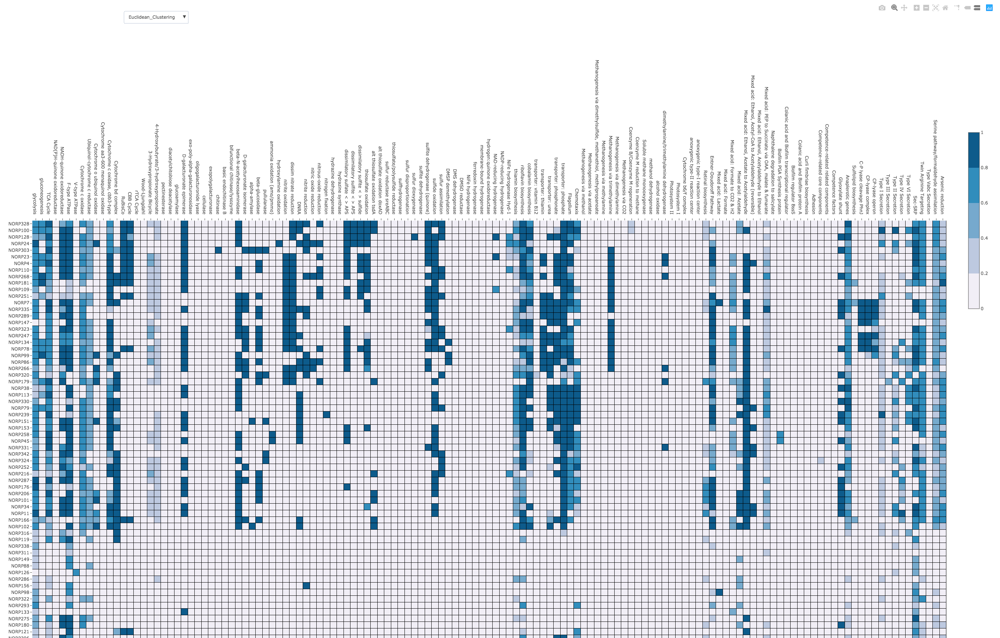

I've been a fan of [ghostKOALA](https://www.kegg.jp/ghostkoala/) for a while, but 
uploading batches of 300mb files to a web interface was a pain.
Enter [kofamscan](https://www.biorxiv.org/content/10.1101/602110v1)! KEGG published hmm
profiles of each KEGG ortholog and implemented a tool to search amino acid sequences for 
them. There is still a web interface, but there is also an command line tool. 

The documentation states that kofamscan needs to be run on linux, but I was successful 
running it on unix using conda. 

I downloaded the databases and executables using:

```
wget ftp://ftp.genome.jp/pub/db/kofam/ko_list.gz		# download the ko list 
wget ftp://ftp.genome.jp/pub/db/kofam/profiles.tar.gz 		# download the hmm profiles
wget ftp://ftp.genome.jp/pub/tools/kofamscan/kofamscan.tar.gz	# download kofamscan tool
wget ftp://ftp.genome.jp/pub/tools/kofamscan/README.md		# download README
```

And then I unzipped and untarred the relevant files:

```
gunzip ko_list.gz
tar xf profiles.tar.gz
tar xf kofamscan.tar.gz
```

Next, I made a conda environment using miniconda:

```
conda create -n kofamscan hmmer parallel
conda activate kofamscan
conda install -c conda-forge ruby
```

I copied the template config file and added the relative paths of my newly downloaded 
kofamscan databases. 

`config.yml`:

```
# Path to your KO-HMM database
# A database can be a .hmm file, a .hal file or a directory in which
# .hmm files are. Omit the extension if it is .hal or .hmm file
profile: ./profiles

# Path to the KO list file
ko_list: ko_list

# Path to an executable file of hmmsearch
# You do not have to set this if it is in your $PATH
# hmmsearch: /usr/local/bin/hmmsearch

# Path to an executable file of GNU parallel
# You do not have to set this if it is in your $PATH
# parallel: /usr/local/bin/parallel

# Number of hmmsearch processes to be run parallelly
cpu: 8
```

Lastly, I ran kofamscan:

```
./exec_annotation -f mapper -o norp88.txt norp88.faa
```

This gives an output file that looks like this:

```
NORP88_1
NORP88_2
NORP88_3	K01869
NORP88_4
NORP88_5
NORP88_6	K07082
NORP88_7
NORP88_8	K07448
NORP88_9
NORP88_10	K07507
```

This output is handy because it can be fed into tools like 
[KEGG Mapper](https://www.genome.jp/kegg/mapper.html), or 
[KEGGDecoder](https://github.com/bjtully/BioData/tree/master/KEGGDecoder) 
(binderized repo [here](https://github.com/rotheconrad/KEGGDecoder-binder)).



If you would prefer more information in the output, you can run kofamscan like this:

```
./exec_annotation -o norp88.txt norp88.faa
```

Which will give you an output that looks like this:

```
# gene name           KO     thrshld  score   E-value KO definition
#-------------------- ------ ------- ------ --------- ---------------------
  NORP88_1            K08365  144.47  110.1   3.1e-33 MerR family transcriptional regulator, mercuric resistance operon regulatory protein
  NORP88_1            K19591  142.77  100.3   4.3e-30 MerR family transcriptional regulator, copper efflux regulator
  NORP88_1            K13638  155.43   92.3   1.1e-27 MerR family transcriptional regulator, Zn(II)-responsive regulator of zntA
  NORP88_1            K19592  232.93   81.3   2.8e-24 MerR family transcriptional regulator, gold-responsive activator of gol and ges genes
  NORP88_1            K13639   94.60   71.5   2.3e-21 MerR family transcriptional regulator, redox-sensitive transcriptional activator SoxR
  NORP88_1            K21902  104.73   57.9   5.2e-17 MerR family transcriptional regulator, repressor of the yfmOP operon
  NORP88_1            K03713   95.73   51.6   4.1e-15 MerR family transcriptional regulator, glutamine synthetase repressor
  NORP88_1            K11923   90.23   49.8   1.6e-14 MerR family transcriptional regulator, copper efflux regulator
  NORP88_1            K21745  122.63   49.2   2.4e-14 MerR family transcriptional regulator, aldehyde-responsive regulator
  NORP88_1            K21744  271.80   47.3     8e-14 MerR family transcriptional regulator, thiopeptide resistance regulator
  NORP88_1            K19057   92.77   44.3   6.9e-13 MerR family transcriptional regulator, mercuric resistance operon regulatory protein
  NORP88_1            K13640   93.23   39.6   1.7e-11 MerR family transcriptional regulator, heat shock protein HspR
  NORP88_1            K19575  165.97   30.4   1.4e-08 MerR family transcriptional regulator, activator of bmr gene
  NORP88_1            K22491  147.63   30.3   1.2e-08 MerR family transcriptional regulator, light-induced transcriptional regulator
  NORP88_1            K21743  509.60   26.6   1.5e-07 MerR family transcriptional regulator, multidrug-efflux activator
  NORP88_1            K19432   68.37   13.2     0.003 anti-repressor of SlrR
  NORP88_1            K21089  347.10   11.7    0.0047 MerR family transcriptional regulator, activator of the csg genes
  NORP88_2            K19340  299.70  103.5   5.2e-31 Cu-processing system ATP-binding protein
  NORP88_2            K01990  225.27  101.3   3.3e-30 ABC-2 type transport system ATP-binding protein
  NORP88_2            K11050  351.23   85.7   1.3e-25 multidrug/hemolysin transport system ATP-binding protein
  NORP88_2            K09695  352.50   85.1   2.1e-25 lipooligosaccharide transport system ATP-binding protein
  NORP88_2            K05643 1692.60   82.1   9.4e-25 ATP-binding cassette, subfamily A (ABC1), member 3
  NORP88_2            K20459  365.53   77.8   3.7e-23 lantibiotic transport system ATP-binding protein
  NORP88_2            K02056  573.30   75.8     1e-22 simple sugar transport system ATP-binding protein [EC:3.6.3.17]
  NORP88_2            K09817  238.00   75.1   2.4e-22 zinc transport system ATP-binding protein [EC:7.2.2.-]
  NORP88_2            K10441  630.83   74.6   2.6e-22 ribose transport system ATP-binding protein [EC:3.6.3.17]
```
