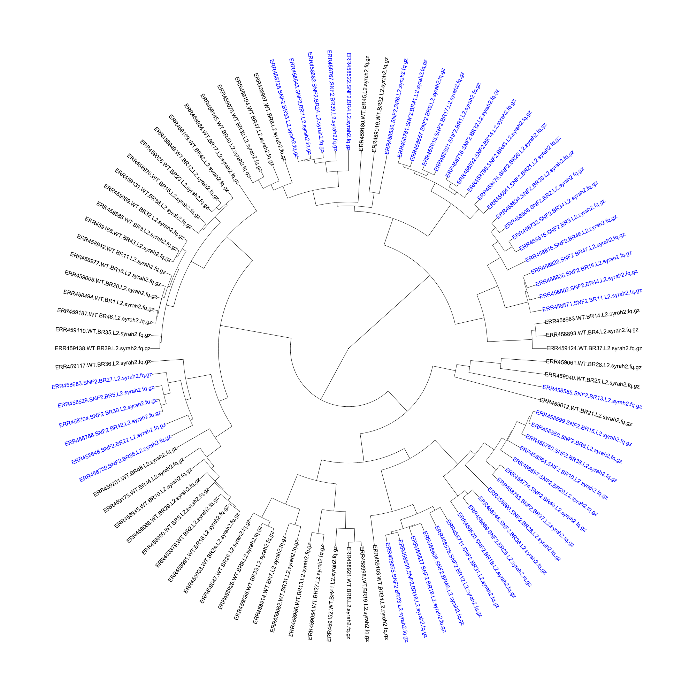

The DIB lab has recently been spending a lot of time with sourmash. This tool adapts the MinHash approach [1] to compare nucleotide sequences to each other. My first project when I joined the lab was to evaluate how well sourmash compare performs with RNA-seq data [2].

To evaluate this, I used a yeast data set with 672 samples: 48 biological replicates of WT and SNF2 mutants. Each biological replicate was run on each lane of the sequencer once, producing seven technical replicates [3]. I chose to only work with portions of the dataset.

I started by getting a handle on what was in the dataset and how sourmash compare interpretted it. I used sourmash signature files downloaded via Syrah [4] (which is not actually for RNA-seq reads, but the files had already been generated) and piped in to sourmash compute, and ran sourmash compare on all of the lane 2 samples to see how well WT clustered with WT, and mutant clustered with mutant.

Not that well, it turns out. The mutant samples are in blue, while the WT samples are in black in the dendrogram below:

With the less-than-perfect pre-processing, I was not discouraged. I decided that I needed to get a better handle on how sourmash compute parameters impact sourmash compare output, so I downloaded the original files for the seven technical replicates of SNF2 mutant biological replicate 13. I trimmed the reads for erroneous kmers using khmer trim-low-abund.py with the --variable-coverage flag [5]. In calculating the signatures files, I used different --scaled parameters and different kmer sizes, and then used sourmash compare to determine how the different parameters changed the similarity detected between samples. I was expecting high percent similarity between samples, as they were technical replicates.

As can be seen below, modestly high kmer sizes coupled with more than 25 hashes in a file correlated well with strong sourmash compare performance.

Next, I used --scaled sizes of 20K-80K, and kmer sizes of 18, 27, and 36 to see how well sourmash compare clustered samples from two WT and two mutant samples, using all seven technical replicates from each biological replicate.

It seemed to do pretty well with the technical replicates, but WT and mutant samples clustered more closely than WT and WT for essentially all parameter values. I changed up the color scheme from above to try and make it more color-blind friendly. The mutants are in magenta, while the WT are in cyan.

To evaluate whether sourmash was mistakenly making these clustering assignments, I then performed a differential expression analysis with the Eel Pond protocol [6]. I took the output from edgeR normalized count values and made an MDS plot, and lo and behold! Sourmash did a pretty darn good job (for the most part)! The MDS plot shows that technical replicates cluster closely, but that the WT samples are more similar to the mutant samples than to each other.

tl;dr: I will now use sourmash as a first-pass approximation of an MDS plot to get an idea of the similarity and clustering of my samples.

Most portem:
I should have used a color-blind friendly color scheme from the beginning.
With a model organism like yeast, it was probably overkill to do the Eel Pond protocol, but it was good practice for me nonetheless
Even kmer sizes are bad-news bears for other applications, because read palindromes are possible. I would have selected a different size if I had known this at the time.

References:
[1] Ondov et al. 2016 DOI:10.1186/s13059-016-0997-x
[2] Sourmash: https://github.com/dib-lab/sourmash
[3] Schurch et al. 2016 DOI:10.1261/rna.053959.115
[4] Syrah: https://github.com/dib-lab/syrah
[5] Khmer: http://khmer.readthedocs.io/en/v2.0/
[6] Eel Pond Protocol: https://github.com/dib-lab/eel-pond
